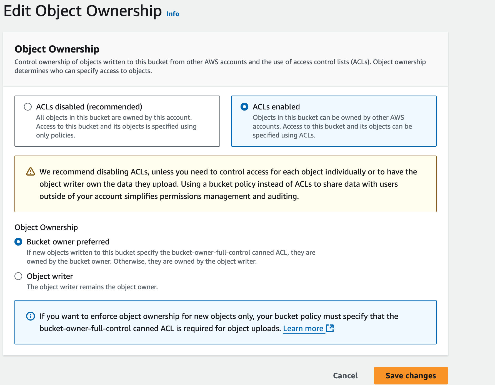

# Miner Setup

This document provides a guide on how to set up and run a miner using `miner.py`. It explains the workflow, configuration options, and step-by-step instructions to get a miner up and running.

## Table of Contents

- [Miner Setup](#miner-setup)
  - [Table of Contents](#table-of-contents)
  - [Prerequisites](#prerequisites)
  - [Installation](#installation)
    - [Automated Installation (Recommended)](#automated-installation-recommended)
    - [Manual Installation](#manual-installation)
  - [Running the Miner](#running-the-miner)
    - [Using PM2 (Recommended)](#using-pm2-recommended)
    - [Important Flags](#important-flags)
  - [Configuration](#configuration)
    - [Hardware Requirements](#hardware-requirements)
    - [Network Options](#network-options)
    - [AWS Setup](#aws-setup)
  - [Monitoring](#monitoring)
    - [Logs](#logs)
    - [Performance](#performance)
  - [Troubleshooting](#troubleshooting)

## Prerequisites

- **NVIDIA GPU** with CUDA support
  - Minimum 24GB VRAM recommended
  - Multiple GPUs supported
- **Ubuntu** (or Ubuntu-based Linux distribution)
- **Python 3.12**
- **CUDA-compatible drivers**
- **AWS S3 Bucket**: Public read access required for validators to access buckets , so that they can download slices, and evaluate them. The required settings are:
  - Block all public access: Off
  

  - Object Ownership:
    - ACL enabled
    - Object Ownership: Bucket Owner Preferred.
    
- **Configure IAM Policy**:
   - Create a new IAM policy:
```json
{
    "Version": "2012-10-17",
    "Statement": [
        {
            "Sid": "VisualEditor0",
            "Effect": "Allow",
            "Action": [
                "s3:PutObject",
                "s3:GetObjectAcl",
                "s3:GetObject",
                "s3:PutObjectVersionAcl",
                "s3:GetObjectAttributes",
                "s3:PutObjectAcl"
            ],
            "Resource": "arn:aws:s3:::<your-bucket-name>/*"
        }
    ]
}
```
   - Replace `<your-bucket-name>` with your actual bucket name
   - This policy provides minimum required permissions:
     - Read objects and their ACLs
     - Write objects and set their ACLs
     - Get object attributes
- **Create IAM User**:
   - Create new IAM user
   - Attach the policy created above
   - Generate access key and secret key
   - Save credentials securely
- **Git**

## Installation

### Automated Installation (Recommended)

The easiest way to set up a miner is using the automated installation script:

```bash
# Clone the repository
git clone https://github.com/RaoFoundation/templar
cd templar

# Make the script executable
chmod +x scripts/run.sh

# Run the installation script
./scripts/run.sh --neuron miner --network <network> \
  --aws-access-key-id <your-key> \
  --aws-secret-access-key <your-secret> \
  --bucket <your-bucket>
```

The script will:
1. Install all required dependencies (Git, npm, pm2, Rust, uv, Python 3.12)
2. Set up AWS credentials
3. Create and register Bittensor wallets
4. Configure wandb for logging
5. Start miners on all available GPUs

### Manual Installation

If you prefer to install manually, follow these steps:

1. **Install System Dependencies**:
```bash
# Add Python 3.12 repository
sudo add-apt-repository ppa:deadsnakes/ppa
sudo apt-get update

# Install required packages
sudo apt-get install python3.12 python3.12-venv git npm
```

2. **Install Node.js and PM2**:
```bash
curl -fsSL https://deb.nodesource.com/setup_18.x | sudo bash
sudo apt-get install -y nodejs
npm install pm2 -g
```

3. **Install Rust and uv**:
```bash
# Install Rust
curl --proto '=https' --tlsv1.2 -sSf https://sh.rustup.rs | sh
source $HOME/.cargo/env

# Install uv
curl -LsSf https://astral.sh/uv/install.sh | sh
```

4. **Set Up Python Environment**:
```bash
# Create virtual environment
uv venv .venv
source .venv/bin/activate

# Install PyTorch
uv pip install torch --index-url https://download.pytorch.org/whl/cu118

# Install requirements
uv sync --extra all --prerelease=allow

# Install flash-attn
uv pip install flash-attn --no-build-isolation
```

5. **Configure AWS Credentials**:
Add to your `~/.bash_profile`:
```bash
export AWS_ACCESS_KEY_ID="your-access-key"
export AWS_SECRET_ACCESS_KEY="your-secret-key"
export BUCKET="your-bucket-name"
```

6. **Create and Register Wallets**:
```bash
# Create coldkey
btcli wallet new_coldkey --wallet.name default --n-words 12

# Create and register hotkeys for each GPU
for i in $(seq 0 $(($(nvidia-smi --query-gpu=name --format=csv,noheader | wc -l) - 1))); do
  btcli wallet new_hotkey --wallet.name default --wallet.hotkey "C$i" --n-words 12
  btcli subnet pow_register --wallet.name default --wallet.hotkey "C$i" --netuid <netuid> --subtensor.network <network>
done
```

## Running the Miner

### Using PM2 (Recommended)

PM2 automatically manages your miner processes and restarts them if they crash:

```bash
# Start a miner on each GPU
for i in $(seq 0 $(($(nvidia-smi --query-gpu=name --format=csv,noheader | wc -l) - 1))); do
  pm2 start neurons/miner.py --interpreter python3 --name miner_C$i -- \
    --actual_batch_size <batch_size> \
    --wallet.name default \
    --wallet.hotkey "C$i" \
    --bucket $BUCKET \
    --device "cuda:$i" \
    --use_wandb \
    --project <project_name> \
    --netuid <netuid> \
    --subtensor.network <network>
done

# Monitor logs
pm2 logs

# Check status
pm2 list
```

### Important Flags

- **`--remote`**: Enables downloading updates from other miners' buckets
- **`--sync_state`**: Synchronizes model state with network history
- **`--actual_batch_size`**: Set based on GPU memory:
  - 80GB+ VRAM: batch size 6
  - 40GB VRAM: batch size 3
  - 24GB VRAM: batch size 1
- **`--netuid`**: Network subnet ID (e.g., 223 for testnet)
- **`--subtensor.network`**: Network name (finney/test/local)
- **`--autoupdate`**: Enable automatic code updates

## Configuration

### Hardware Requirements

- **GPU Memory Requirements**:
  - Minimum: 24GB VRAM
  - Recommended: 40GB+ VRAM
  - Optimal: 80GB+ VRAM
- **Storage**: 100GB+ recommended for model and data
- **RAM**: 32GB+ recommended
- **Network**: Stable internet connection with good bandwidth

### Network Options

- **Mainnet (Finney)**:
  - Network: `finney`
  - Netuid: 3
- **Testnet**:
  - Network: `test`
  - Netuid: 223
  - Endpoint: `wss://test.finney.opentensor.ai:443/`
- **Local**:
  - Network: `local`
  - Netuid: 1
  - Endpoint: `wss://localhost:9944`

### AWS Setup

1. Create an S3 bucket with public read access
2. Configure CORS for validator access
3. Set up IAM user with S3 access
4. Export credentials in environment

## Monitoring

### Logs

- **PM2 Logs**: `pm2 logs [miner_name]`
- **System Monitoring**: `pm2 monit`
- **Weights & Biases**: Enable with `--use_wandb`

### Performance

Monitor key metrics:
- GPU utilization
- Memory usage
- Network bandwidth
- Training progress
- Rewards and weights

## Troubleshooting

Common issues and solutions:
- CUDA out of memory
- Network synchronization issues
- AWS permissions
- Registration failures
