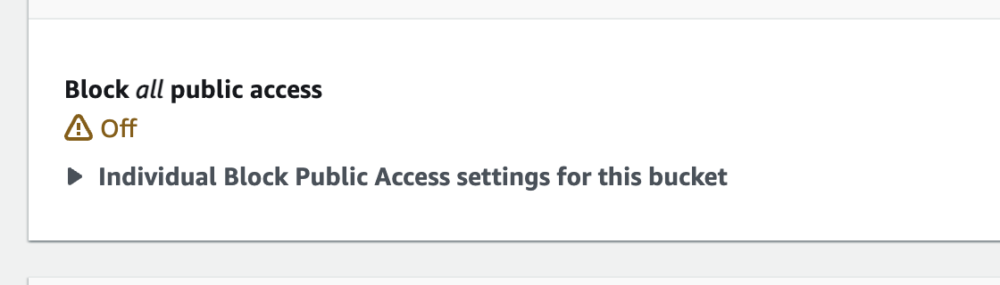
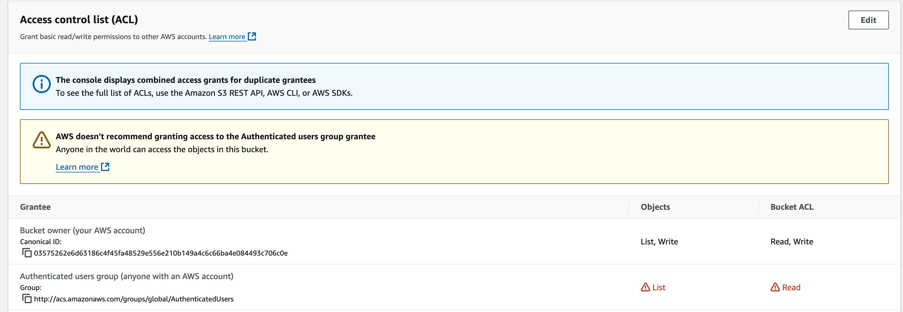

# Validator Setup

This document provides a guide on how to set up and run a validator using `validator.py`. Validators are crucial components of the protocol, responsible for evaluating miners' contributions by comparing their uploaded deltas with locally computed gradients.

## Table of Contents

- [Validator Setup](#validator-setup)
  - [Table of Contents](#table-of-contents)
  - [Prerequisites](#prerequisites)
  - [Installation](#installation)
    - [Automated Installation (Recommended)](#automated-installation-recommended)
    - [Manual Installation](#manual-installation)
  - [Running the Validator](#running-the-validator)
    - [Using PM2 (Recommended)](#using-pm2-recommended)
    - [Important Flags](#important-flags)
  - [Configuration](#configuration)
    - [Hardware Requirements](#hardware-requirements)
    - [Network Options](#network-options)
    - [AWS Setup](#aws-setup)
  - [Monitoring](#monitoring)
    - [Logs](#logs)
    - [Performance](#performance)
  - [Validator Operations](#validator-operations)
    - [State Synchronization](#state-synchronization)
    - [Evaluation Process](#evaluation-process)
    - [Weight Setting](#weight-setting)
  - [Troubleshooting](#troubleshooting)

## Prerequisites

- **NVIDIA GPU** with CUDA support
  - Minimum 24GB VRAM recommended
  - Single GPU typically sufficient
- **Ubuntu** (or Ubuntu-based Linux distribution)
- **Python 3.12**
- **CUDA-compatible drivers**
- **AWS S3 Credentials and Bucket**: Public read is required, so miners / evaluators can download slices. Please refer to this [guide](https://docs.aws.amazon.com/AmazonS3/latest/userguide/bucketnamingrules.html?icmpid=docs_amazons3_console) on s3 naming conventions. The required settings are:
  - Block all public access: Off
  

  - Object Ownership:
    - ACL enabled
    - Object Ownership: Bucket Owner Preferred.
    
- **Configure IAM Policy**:
   - Create a new IAM policy:
```json
{
    "Version": "2012-10-17",
    "Statement": [
        {
            "Sid": "VisualEditor0",
            "Effect": "Allow",
            "Action": [
                "s3:PutObject",
                "s3:GetObjectAcl",
                "s3:GetObject",
                "s3:PutObjectVersionAcl",
                "s3:GetObjectAttributes",
                "s3:PutObjectAcl",
                "s3:DeleteObject"
            ],
            "Resource": "arn:aws:s3:::<your-bucket-name>/*"
        }
    ]
}
```
   - Replace `<your-bucket-name>` with your actual bucket name
   - This policy provides minimum required permissions:
     - Read objects and their ACLs
     - Write objects and set their ACLs
     - Get object attributes
- **Create IAM User**:
   - Create new IAM user
   - Attach the policy created above
   - Generate access key and secret key
   - Save credentials securely
- **Git**

## Installation

<!-- ### Automated Installation (Recommended)

The easiest way to set up a validator is using the automated installation script:

```bash
# Clone the repository
git clone https://github.com/RaoFoundation/templar
cd templar

# Make the script executable
chmod +x scripts/run.sh

# Run the installation script
./scripts/run.sh --neuron validator --network <network> \
  --aws-access-key-id <your-key> \
  --aws-secret-access-key <your-secret> \
  --bucket <your-bucket>
```

The script will:
1. Install all required dependencies (Git, npm, pm2, Rust, uv, Python 3.12)
2. Set up AWS credentials
3. Create and register Bittensor wallet and validator hotkey
4. Configure wandb for logging
5. Start the validator -->

### Manual Installation

If you prefer to install manually, follow these steps:

1. **Install System Dependencies**:
```bash
# Add Python 3.12 repository
sudo add-apt-repository ppa:deadsnakes/ppa
sudo apt-get update

# Install required packages
sudo apt-get install python3.12 python3.12-venv git npm
```

2. **Install Node.js and PM2**:
```bash
curl -fsSL https://deb.nodesource.com/setup_18.x | sudo bash
sudo apt-get install -y nodejs
npm install pm2 -g
```

3. **Install Rust and uv**:
```bash
# Install Rust
curl --proto '=https' --tlsv1.2 -sSf https://sh.rustup.rs | sh
source $HOME/.cargo/env

# Install uv
curl -LsSf https://astral.sh/uv/install.sh | sh
```

4. **Set Up Python Environment**:
```bash
# Create virtual environment
uv venv .venv
source .venv/bin/activate

# Install PyTorch
uv pip install torch --index-url https://download.pytorch.org/whl/cu118

# Install requirements
uv sync --extra all --prerelease=allow

# Install flash-attn
uv pip install flash-attn --no-build-isolation
```

5. **Configure AWS Credentials**:
Add to your `~/.bash_profile`:
```bash
export AWS_ACCESS_KEY_ID="your-access-key"
export AWS_SECRET_ACCESS_KEY="your-secret-key"
export BUCKET="your-bucket-name"
```

6. **Create and Register Validator Wallet**:
```bash
# Create coldkey
btcli wallet new_coldkey --wallet.name default --n-words 12

# Create and register validator hotkey
btcli wallet new_hotkey --wallet.name default --wallet.hotkey validator --n-words 12
btcli subnet pow_register --wallet.name default --wallet.hotkey validator --netuid <netuid> --subtensor.network <network>
```

## Running the Validator

### Using PM2 (Recommended)

PM2 automatically manages your validator process and restarts it if it crashes:

```bash
pm2 start neurons/validator.py --interpreter python3 --name validator -- \
  --actual_batch_size 6 \
  --wallet.name default \
  --wallet.hotkey validator \
  --bucket $BUCKET \
  --use_wandb \
  --project <project_name> \
  --netuid <netuid> \
  --subtensor.network <network> \
  --process_name validator \  # Must match PM2's --name
  --autoupdate \
  --remote

> **Important**: When using PM2, the `--process_name` argument must match the PM2 process name specified by `--name`. In this example, PM2 process is named `validator`, so we use `--process_name validator`.

# Monitor logs
pm2 logs validator

# Check status
pm2 list
```

### Important Flags

- **`--process_name`**: (Required) Must match the PM2 process name when using PM2
- **`--sync_state`**: Synchronizes model state with network history (crucial)
- **`--actual_batch_size`**: Set based on GPU memory:
  - 80GB+ VRAM: batch size 6
  - 40GB VRAM: batch size 3
  - 24GB VRAM: batch size 1
- **`--netuid`**: Network subnet ID (e.g., 223 for testnet)
- **`--subtensor.network`**: Network name (finney/test/local)
- **`--autoupdate`**: Enable automatic code updates

## Configuration

### Hardware Requirements

- **GPU Memory Requirements**:
  - Minimum: 24GB VRAM
  - Recommended: 40GB VRAM
  - Optimal: 80GB VRAM
- **Storage**: 200GB+ recommended for model and evaluation data
- **RAM**: 32GB+ recommended
- **Network**: High-bandwidth, stable connection for state synchronization

### Network Options

- **Mainnet (Finney)**:
  - Network: `finney`
  - Netuid: 3
- **Testnet**:
  - Network: `test`
  - Netuid: 223
  - Endpoint: `wss://test.finney.opentensor.ai:443/`
- **Local**:
  - Network: `local`
  - Netuid: 1
  - Endpoint: `wss://localhost:9944`

### AWS Setup

1. Create an S3 bucket for storing validator data
2. Configure bucket permissions for public read access
3. Set up IAM user with S3 access
4. Export credentials in environment

## Monitoring

### Logs

- **PM2 Logs**: `pm2 logs validator`
- **System Monitoring**: `pm2 monit`
- **Weights & Biases**: Enable with `--use_wandb`
  - Training metrics
  - Evaluation scores
  - Network statistics

### Performance

Monitor key metrics:
- GPU utilization
- Memory usage
- Network bandwidth
- Evaluation throughput
- Weight setting frequency

## Validator Operations

### State Synchronization

- Initial sync downloads full model state
- Continuous sync with new updates
- Delta application and verification
- State consistency checks

### Evaluation Process

1. Download miner deltas
2. Compute local gradients
3. Compare and score contributions
4. Update weights based on quality

### Weight Setting

- Scoring mechanisms
- Weight update frequency
- Impact on network consensus
- Optimization strategies

## Troubleshooting

Common issues and solutions:
- State synchronization failures
- Out of memory errors
- Network connectivity issues
- Weight setting delays
- AWS access problems

